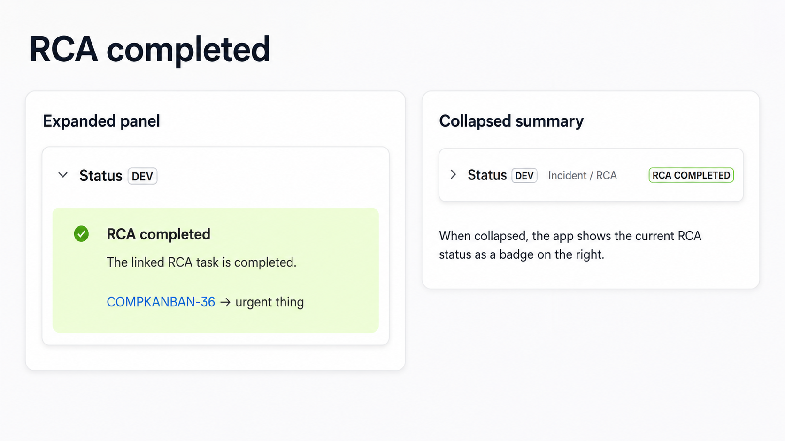
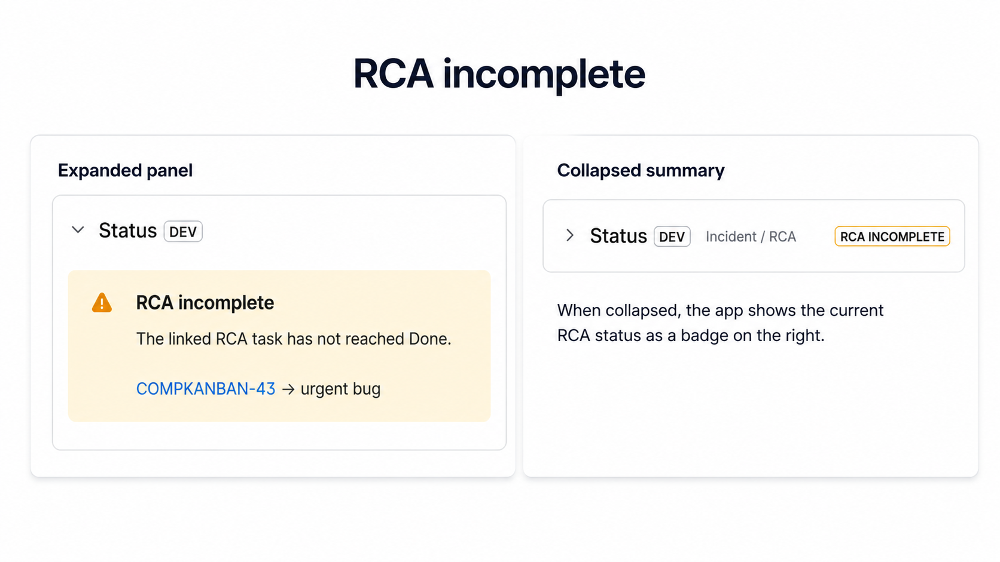
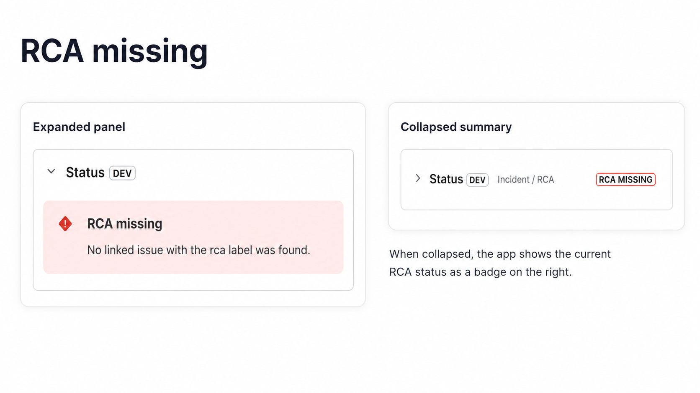

# Incident / RCA Status Forge app

[← Back to the portfolio overview](../../README.md#forge-incident--rca-status)

This directory contains an Atlassian Forge UI Kit app for Jira Cloud. It adds an **Incident / RCA** context panel to Incident work items and summarizes the state of linked RCA work items.

## Result in brief

Installing the app adds a read-only context panel to an Incident. The panel reports **RCA missing**, **RCA incomplete**, or **RCA completed** from linked work items carrying the `rca` label. The same state remains visible as a compact badge when the panel is collapsed.



A panel showing **RCA missing** is already a successful smoke test: the app is installed, rendered, and able to inspect the current Incident.

## What the app demonstrates

- a Jira `issueContext` Forge module;
- Forge UI Kit rendering with React-style components from `@forge/react`;
- Jira REST access through `requestJira`;
- dynamic context-panel properties and lozenge status;
- navigation links to related Jira work items;
- a small read-only app that can be deployed independently from the Terraform configuration.

## Structure

```text
custom-apps/incident-rca-status/
├── manifest.yml
├── package.json
├── package-lock.json
└── src/
    ├── dynamic-properties.js
    ├── frontend/index.jsx
    ├── index.js
    └── resolvers/index.js
```

Important files:

- `manifest.yml` registers the Jira issue-context module, runtime, functions, app ID, and Jira scopes.
- `src/frontend/index.jsx` renders the visible panel.
- `src/dynamic-properties.js` calculates the compact status shown when the panel is collapsed.
- `package-lock.json` pins the Node.js dependency tree used by `npm ci`.

## Prerequisites

The root development container includes Node.js and Forge CLI. Start it using the instructions in the [root README](../../README.md#shared-development-environment).

The container receives Forge credentials and the Jira URL from the root `jira-cloud-iac-dev.env` file:

```dotenv
FORGE_EMAIL=you@example.com
FORGE_API_TOKEN=replace-with-forge-api-token
ATLASSIAN_URL=https://your-site.atlassian.net
```

Use an Atlassian API scoped token created for Forge as `FORGE_API_TOKEN`.

The account must be allowed to deploy the Forge app and install it on the target Jira Cloud site.

## Install dependencies

Inside the development container:

```sh
cd /workspace/custom-apps/incident-rca-status
npm ci
```

Use `npm ci` rather than `npm install` for a reproducible install based on `package-lock.json`.

Expected result: dependencies are installed successfully and `package-lock.json` remains unchanged.

## Validate, deploy, and install

```sh
forge whoami
forge lint
forge deploy --non-interactive -e development
forge install --non-interactive \
  --site "$ATLASSIAN_URL" \
  --product jira \
  --environment development
```

`ATLASSIAN_URL` is provided by the root `jira-cloud-iac-dev.env` file.

The first installation associates the deployed Forge app with the Jira site.

Expected result:

- `forge whoami` shows the intended Atlassian account;
- `forge lint` completes without errors;
- deployment to the `development` environment succeeds;
- installation on the Jira site succeeds.

For ordinary source-code updates:

```sh
forge deploy --non-interactive -e development
```

When scopes or installation permissions change:

```sh
forge install --non-interactive --upgrade \
  --site "$ATLASSIAN_URL" \
  --product jira \
  --environment development
```

## Expected Jira behavior

The panel is configured for the `Incident` work type. On an Incident work item, it should:

- show the **Incident / RCA** context panel;
- locate linked work items marked as RCA items by the app logic;
- display their keys, summaries, links, and current status;
- show an explanatory state when no RCA item is found or the data cannot be resolved.

A quick successful check does not require a completed RCA workflow. If the panel appears and shows **RCA missing**, the app is installed, rendered, and able to inspect the Incident.

The app exposes the same status in two forms:

- the **expanded panel** shows the explanation and links to matching RCA work items;
- the **collapsed summary** keeps the current RCA status visible as a badge on the right.

### RCA completed

A linked RCA work item exists and has reached the Jira **Done** status category.

### RCA incomplete

A linked RCA work item exists, but it has not reached the Jira **Done** status category.



### RCA missing

No linked work item with the `rca` label was found.



The Terraform part of this repository configures demo Jira spaces and schemes, but it does not create all example Incident/RCA work items required to populate the panel.

## App identity

`manifest.yml` contains a checked-in Forge `app.id`. That ID belongs to one registered Forge application.

To create an independent deployment under another Atlassian developer account, register or create a Forge app and replace the manifest app ID. Do not expect one app ID to be owned by unrelated accounts.

## Permissions and safety

The supplied app is read-only and requests the Jira read scope declared in `manifest.yml`. Keep scopes minimal and run `forge lint` before deployment.

## Related documentation

- [Portfolio overview](../../README.md#forge-incident--rca-status)
- [Terraform configuration](../../terraform/README.md)
